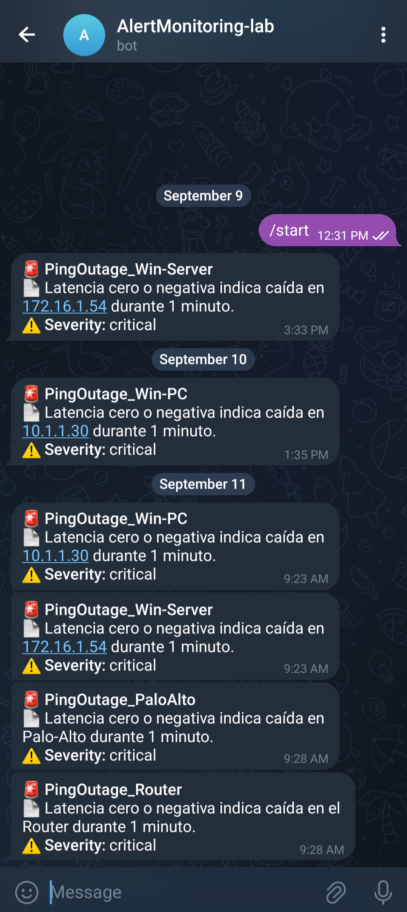

## Network Monitoring App - Final Project.

This project was developed as part of the IBM SRE Academy to deliver a lightweight, reproducible, and educational network monitoring solution. It tracks the availability and latency of key devices using ICMP probes, visualizes metrics in Grafana, and sends real-time alerts via Telegram. Designed for both simulated and real environments, it integrates modern observability tools and automation workflows to streamline deployment and monitoring.

## Project Structure
```
ping-monitor/
├── ansible/
│   └── playbooks/
│       ├── deploy-monitoring.yml         # Deploys Prometheus, Grafana, Alertmanager, Telegram webhook
│       ├── validate.yml                  # Validates service health via internal cluster endpoints
│       └── cleanup-all-namespaces.yml    # Cleans up completed/failed pods across key namespaces
├── .github/
│   └── workflows/
│       ├── ci.yaml                       # Full CI/CD pipeline: cleanup, deploy, validate
│       └── deploy.yaml                   # Lightweight deploy-only workflow
├── infra/
│   ├── prometheus/                       # Prometheus config, rules, and values
│   └── alertmanager/                     # Alertmanager configuration
├── k8s/
│   ├── permisos-rbac/                    # Prometheus RBAC manifests
│   ├── monitoring/                       # Monitoring service manifests
│   ├── deployments/                      # Network monitor deployment and ServiceMonitor
│   └── telegram-webhook/                 # Telegram webhook deployment, secret, and service
├── dashboards/
│   └── ping-latency-dashboard.json       # Grafana dashboard for latency / outage visualization
├── src/
│   ├── app/                              # Core app logic (ping utils, config, main)
│   └── telegram-webhook/                 # Telegram webhook service (Dockerized)
├── scripts/                              # Setup and cleanup scripts
├── .env                                  # Environment variables
├── check_env.py                          # Environment validation script
├── docker-compose.yaml                   # Local orchestration
├── Dockerfile                            # Container build for core app
├── requirements.txt                      # Python dependencies
├── README.md                             # Project documentation
```

## Tech Stack

- Python: Custom ICMP probe exporter (ping-monitor)
- Prometheus: Metrics collection and scraping
- Grafana: Dashboard visualization
- Alertmanager: Alert routing and Telegram integration
- Docker & Docker Compose: Local container orchestration
- Kubernetes: Optional cluster deployment
- Ansible: Automated provisioning and cleanup
- GitHub Actions: CI/CD workflows for validation and deployment
- EVE-NG: Network simulation for testing

## Architecture Diagram
```
[ping-monitor app] → [Prometheus] → [Alertmanager] → [Telegram]
                          ↓
                      [Grafana]
```
## Metrics Overview

The Python app pings a list of devices and exposes latency metrics:

Example text:
device_ping_latency_ms{device="123.1.1.1"} 23.5
device_ping_latency_ms{device="123.1.1.1"} -1

- 0 or -1 indicates unreachable or failed ping.
- +1 Ping success status.
- Metrics are refreshed every 30 seconds.

## Educational Use Case:

This project is ideal for:
- Simulating network outages and latency spikes in EVE-NG
- Teaching observability fundamentals: metrics, dashboards, and alerting
- Practicing CI/CD automation and infrastructure as code
- Demonstrating real-time monitoring in containerized environments


1. Quick Start

# Clone the repository
```
git clone https://github.com/steven777psn-wq/Network-Monitoring-app-Proyecto-Final.git
cd Network-Monitoring-app-Proyecto-Final
```
# Launch locally with Docker Compose
```
cd infra
docker-compose up --build
```

## CI/CD Workflows

GitHub Actions automate:
- Linting and validation of Python and YAML files
- Deployment to Docker or Kubernetes
- Cleanup routines for reproducible lab environments


## Accessing Monitoring Interfaces (Kubernetes Deployment)
Use the following port-forwarding commands to access the monitoring interfaces locally:
- Grafana
```
kubectl port-forward svc/kube-prometheus-stack-grafana 3001:80 -n monitoring
```
Then open: http://localhost:3001

- Prometheus
```
kubectl port-forward svc/kube-prometheus-stack-prometheus 9191:9090 -n monitoring
```
Then open: http://localhost:9191

- Alertmanager
```
kubectl port-forward svc/kube-prometheus-stack-alertmanager 9193:9093 -n monitoring
```
Then open: http://localhost:9193

<<<<<<< HEAD
=======

>>>>>>> 0b86925 (enhance README with architecture, quick start, metrics table, and screenshots section)
## Screenshots

- Prometheus target status


- Grafana dashboard with latency graphs


- Telegram alert messages


## EVE-NG Lab Integration

 This project is also deployed and tested within a custom EVE-NG lab environment, allowing for realistic network simulations scenarios.
- The lab includes virtual routers, switches, Win Server, Palo Alto Firewall and Linux & Windows hosts configured to respond to ICMP probes.
- Prometheus and the Python monitoring app are deployed in isolated containers within the lab.
- This setup enables controlled testing of latency, packet loss, and alerting behavior under various network conditions.
- EVE-NG provides a visual topology and supports reproducible demos for testing and education.


## Contributions

This project is open to improvements. Please refer to the [CONTRIBUTING.md](CONTRIBUTING.md) guide to learn how to collaborate.

## License

This project is licensed under the MIT License. See [LICENSE](LICENSE) for more details.

## Process Evidence

Screenshots of deployment, monitoring, and alerting are available in the `/screenshots` folder.


End...


