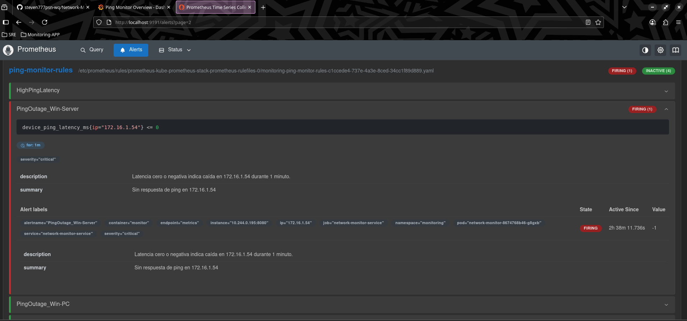

## Network Monitoring Project

This project provides a lightweight, containerized network monitoring solution using Python, Prometheus, Alertmanager, and Grafana dashboards. It is designed for educational and practical use, with a focus on clarity, reproducibility, and modular deployment.

## Table of Contents

- [Features](#features)
- [Technologies Used](#technologies-used)
- [Metrics Overview](#metrics-overview)
- [Deployment](#deployment)
- [Alerting System](#alerting-system)
- [Lab Integration (EVE-NG)](#lab-integration-eve-ng)
- [Automation Components](#automation-components)
- [Screenshots](#process-evidence)
- [Contributions](#contributions)
- [License](#license)


## Project Structure
```
ping-monitor/
├── ansible/
│   └── playbooks/
│       ├── deploy-monitoring.yml         # Deploys Prometheus, Grafana, Alertmanager, Telegram webhook
│       ├── validate.yml                  # Validates service health via internal cluster endpoints
│       └── cleanup-all-namespaces.yml    # Cleans up completed/failed pods across key namespaces
├── .github/
│   └── workflows/
│       ├── ci.yaml                       # Full CI/CD pipeline: cleanup, deploy, validate
│       └── deploy.yaml                   # Lightweight deploy-only workflow
├── infra/
│   ├── prometheus/                       # Prometheus config, rules, and values
│   └── alertmanager/                     # Alertmanager configuration
├── k8s/
│   ├── permisos-rbac/                    # Prometheus RBAC manifests
│   ├── monitoring/                       # Monitoring service manifests
│   ├── deployments/                      # Network monitor deployment and ServiceMonitor
│   └── telegram-webhook/                 # Telegram webhook deployment, secret, and service
├── dashboards/
│   └── ping-latency-dashboard.json       # Grafana dashboard for latency / outage visualization
├── src/
│   ├── app/                              # Core app logic (ping utils, config, main)
│   └── telegram-webhook/                 # Telegram webhook service (Dockerized)
├── scripts/                              # Setup and cleanup scripts
├── .env                                  # Environment variables
├── check_env.py                          # Environment validation script
├── docker-compose.yaml                   # Local orchestration
├── Dockerfile                            # Container build for core app
├── requirements.txt                      # Python dependencies
├── README.md                             # Project documentation
```
---

## Features

- ICMP-based latency monitoring using `ping3`
- Prometheus metrics endpoint (`/metrics`)
- Status endpoint (`/status`) for basic health checks
- Custom metric: `device_ping_latency_ms`
- Alertmanager integration with sample alert rules
- Telegram webhook integration for real-time notifications
- Alert routing based on Prometheus job labels
- Docker Compose and Kubernetes support
- Helm-based Prometheus stack deployment
- Grafana integration

## Technologies Used

| Technology         | Purpose                                   | Notes / Integration                      |
|--------------------|-------------------------------------------|------------------------------------------|
| Python + ping3     | ICMP-based latency monitoring             | Custom metrics exposed via `/metrics`    |
| Prometheus         | Metrics scraping and alert rule engine    | Deployed via Helm                        |
| Grafana            | Dashboard visualization                   | Latency, outage heatmaps                 |
| Alertmanager       | Alert routing                             | Integrated with Telegram webhook         |
| Telegram Webhook   | Real-time notifications                   | Custom Flask app                         |
| Docker Compose     | Local orchestration                       | Multi-container setup                    |
| Kubernetes         | Production-grade deployment               | Manifests + Helm charts                  |
| Ansible            | Automation of deployment and validation   | Playbooks for CI/CD                      |
| GitHub Actions     | CI/CD pipeline                            | Cleanup, deploy, validate workflows      |
| EVE-NG             | Lab simulation environment                | Virtual routers, firewalls, hosts        |

---

## Metrics Overview

The Python app pings a list of devices and exposes latency metrics:

Example text:
device_ping_latency_ms{device="123.1.1.1"} 23.5
device_ping_latency_ms{device="123.1.1.1"} -1

• 	-1 indicates unreachable or failed ping.
•       0 also considered unreachable in alert logic
• 	Metrics are refreshed every 30 seconds.

## Local Deployment (Docker Compose)

cd infra/
docker-compose up --build

## Kubernetes Deploymen
1. Apply manifests

kubectl apply -f k8s/YAMLs

Includes:
• 	Deployment and Service for the Python app
• 	Prometheus  for scraping metrics
• 	Alertmanager configuration
•       Telegram webhook deployment and service

Monitored Metrics:

| Metric Name                  | Description                          | PromQL Example                          |
|------------------------------|--------------------------------------|-----------------------------------------|
| `device_ping_latency_ms`     | Latency per device (ICMP)            | `avg(device_ping_latency_ms)`           |
| `up`                         | Service availability                 | `up == 0` for unreachable targets       |
| `probe_success` (optional)   | Ping success indicator               | `sum(probe_success)`                    |

2. Deploy Prometheus stack via Helm

helm repo add prometheus-community https://prometheus-community.github.io/helm-charts
helm install kube-prometheus-stack prometheus-community/kube-prometheus-stack -f infra/prometheus/custom-values.yaml -n monitoring

Note: Ensure your app's Service has correct labels for Prometheus discovery.


3. Access Grafana

kubectl port-forward svc/kube-prometheus-stack-grafana 3001:80 -n monitoring
kubectl get secret kube-prometheus-stack-grafana -n monitoring -o jsonpath="{.data.admin-password}" | base64 -d

Planned Grafana Dashboard
•       Latency over time per device
•       Alert visualization for unreachable hosts
•       Outage heatmap per device


## Alerting System

•       Prometheus alert rules defined in infra/prometheus/prometheus-rule.yaml
•       Alerts include:
        - High latency detection
        - Outage detection (<= 0 latency)
•       Alertmanager routes only alerts from job="network-monitor-service" to Telegram
•       Telegram webhook receives alerts via HTTP and forwards them to your bot



## Telegram Webhook Integration
• 	Custom Flask app deployed as a Kubernetes service
• 	Receives alerts from Alertmanager via webhook
• 	Filters and formats messages for Telegram delivery
• 	Alertmanager config uses matchers to route only relevant alerts
        - matchers:
          - job = "network-monitor-service"

<h4>Notificaciones por Telegram</h4>


## EVE-NG Lab Integration

 This project is also deployed and tested within a custom EVE-NG lab environment, allowing for realistic network simulations scenarios.
• 	The lab includes virtual routers, switches, Win Server, Palo Alto Firewall and Linux & Windows hosts configured to respond to ICMP probes.
• 	Prometheus and the Python monitoring app are deployed in isolated containers within the lab.
• 	This setup enables controlled testing of latency, packet loss, and alerting behavior under various network conditions.
• 	EVE-NG provides a visual topology and supports reproducible demos for testing and education.


## Monitoring Integration
• 	The Python monitoring app pings key devices across VLANs
• 	Prometheus scrapes metrics from the app, enabling visibility into latency and reachability across zones
• 	Alertmanager triggers notifications when devices become unreachable or latency exceeds thresholds
• 	Telegram webhook delivers alerts in real time to your configured bot/channe

## Lab Monitoring Stack: CI/CD + Ansible Automation

This repository automates the deployment and validation of a Kubernetes-based monitoring stack using Ansible and GitHub Actions. It includes Prometheus, Grafana, Alertmanager, and a Telegram webhook, with full CI/CD integration and healthcheck routines.

Components:
- Ansible Playbooks for deployment, cleanup, and validation
- GitHub Actions Workflows for CI/CD automation
- Kubernetes Manifests for RBAC, services, and monitoring pods

## Automation Components

| Component             | Description                                  | Location / File                         |
|-----------------------|----------------------------------------------|------------------------------------------|
| Deployment Playbook   | Applies all Kubernetes manifests             | `ansible/playbooks/deploy-monitoring.yml` |
| Validation Playbook   | Healthchecks for Prometheus, Grafana, webhook| `ansible/playbooks/validate.yml`         |
| Cleanup Playbook      | Deletes residual pods across namespaces      | `ansible/playbooks/cleanup-all-namespaces.yml` |
| CI/CD Workflow        | Full pipeline: cleanup, deploy, validate     | `.github/workflows/ci.yaml`              |
| Lightweight Deploy    | Deploy-only monitoring workflow              | `.github/workflows/deploy.yaml`          |

Directory Structure:
```
|ping-monitor/
| 
├── ansible/
│   └── playbooks/
│       ├── deploy-monitoring.yml
│       ├── validate.yml
│       └── cleanup-all-namespaces.yml
├── .github/
│   └── workflows/
│       ├── ci.yaml
│       └── deploy.yaml
```
1. Deployment Playbook:
File: ansible-playbook ansible/playbooks/deploy-monitoring.yml
Applies all required Kubernetes manifests for the monitoring stack:
• 	Prometheus: RBAC, rules, configuration
• 	Alertmanager: configuration
• 	Telegram webhook
• 	Network monitoring services

2. Validation Playbook: 
File: ansible-playbook ansible/playbooks/validate.yml
Performs healthchecks using internal cluster DNS:
• 	Prometheus readiness ()
• 	Grafana availability
• 	Telegram webhook pod status
Includes conditional logic to print success or failure messages.

3. Cleanup Playbook: 
File: ansible/playbooks/cleanup-all-namespaces.yml
Removes residual pods across key namespaces:
- Completed pods
- Failed pods
- Pods with ContainerStatusUnknown

4. GitHub Actions Workflows (CI/CD)
 4.1. ci.yaml – Full CI/CD Pipeline
Triggered on every push to main or manually. Steps:
- Checkout repository
- Install dependencies (ansible, kubectl)
- Cleanup residual pods
- Deploy monitoring stack
- Validate services
```
name: RootZone CI/CD Pipeline
on:
  push:
    branches: [ "main" ]
  workflow_dispatch:
```
  
 4.2. Deploy.yaml: Lightweight Deployment
Runs only the deployment playbook on push to main.
```
name: Deploy Monitoring Stack
on:
  push:
    branches:
      - main
```

Both workflows run on a self-hosted runner for full control over the environment

5. Pre-commit Validation
Before pushing changes:
```
# Lint for best practices
ansible-lint ansible/playbooks/*.yml

# Dry-run to preview changes
ansible-playbook ansible/playbooks/deploy-monitoring.yml --check
```
6. Notifications & Healthchecks
The validation playbook includes logic to:
- Show endpoint status
- Detect failures
- Print success or failure messages
It can be extended to send Telegram alerts...(Will work on this latter)

## Notes
- File paths are dynamically resolved.
- Error handling is built-in with ignore_errors: true and conditional blocks.


## Contributions

This project is open to improvements. Please refer to the [CONTRIBUTING.md](CONTRIBUTING.md) guide to learn how to collaborate.

## License

This project is licensed under the MIT License. See [LICENSE](LICENSE) for more details.

## Process Evidence

Screenshots of deployment, monitoring, and alerting are available in the `/screenshots` folder.


End...


